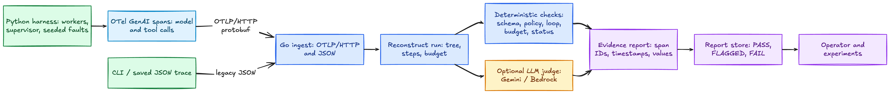
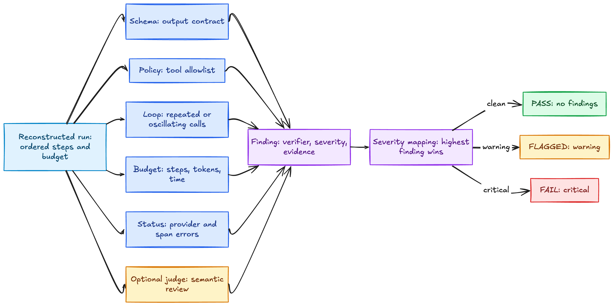
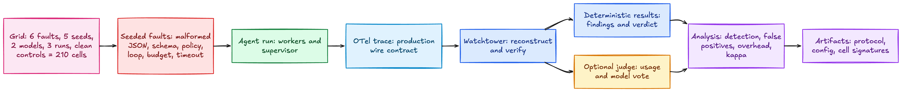

# Watchtower

**Watchtower keeps an eye on AI agents while they work.** It watches
what your agents actually do, every model call and every tool call,
reconstructs each "run" from that record, and tells you, with evidence,
whether the run was healthy or broken.

Think of it as a flight recorder plus an inspector for agent runs.
Agents write down everything they did, Watchtower reads the notes,
rebuilds the story, and hands you a verdict: **PASS**, **FLAGGED**, or
**FAIL**, always with the receipts (which call, when, what went wrong).

It is built as a small research project. The pieces are deliberately
simple, everything is testable offline, and every claim about what it
catches is backed by a reproducible experiment.

---

## What this is

A multi-agent system is a handful of AI agents working on a task,
calling tools, reading results, and talking to each other. They fail
in predictable ways: malformed output, tools they should not have
called, the same call repeated forever, blown budgets, timeouts.

Watchtower catches those failures. Three ideas make it work:

1. **Agents write everything down.** The Python harness records every
   model call and tool call as a *span*, a small timestamped receipt
   with the details (model, tokens, tool name, success, output).
2. **A Go service reads the receipts.** It reconstructs the whole run
   from the flat list of spans (who did what, in what order, how much
   it cost) and then runs a handful of *deterministic checks* over it.
   No AI does the checking. The same input always produces the same
   verdict.
3. **Every verdict comes with evidence.** You get the exact span ids,
   timestamps, and offending values that triggered the finding, not a
   vague "something was wrong". Verdicts are reproducible from the
   same trace forever.

An optional **LLM judge** (Gemini or DeepSeek via Bedrock) can add a
second opinion on top. The experiments show it catches things the
deterministic checks miss, and they show judges disagree with each
other. That disagreement is why the deterministic layer is the
backbone.

---

## How it works



| Piece | What it does |
|---|---|
| **Agent harness** (Python) | Your agents: workers with tools, a supervisor that watches them and can halt, reroute, or escalate. Every call is recorded via OpenTelemetry. |
| **OpenTelemetry SDK** | The standard recording layer. Agents emit a *span* per model call and tool call. Anything that speaks OTel can feed Watchtower, not just the bundled harness. |
| **Watchtower** (Go service) | Receives spans, rebuilds the run, checks it, writes the verdict. |
| **LLM judge** (optional) | A second opinion from a frontier model, on a capped sample of runs. |
| **Verdict report** | `PASS` / `FLAGGED` / `FAIL` plus the evidence bundle and a measured token cost when the judge ran. |

### The verification pipeline



The checks are deliberately boring and deterministic:

- **schema**: structured output honored its contract (right JSON, right types)?
- **policy**: every tool call stayed on the allowlist?
- **loop**: did the agent repeat the same call (same tool, same arguments) or oscillate?
- **budget**: steps, tokens, or duration over the limit?
- **status**: did any span end in an error (e.g. a provider timeout)?

Each check emits *findings*, and a finding without evidence is not a
finding. Findings carry the exact span ids, timestamps, and values.
They map to a verdict. A critical finding means `FAIL`, a warning
means `FLAGGED`, and a clean run means `PASS`.

---

## Quick start

Everything below runs **offline**, with no API keys and no network
beyond localhost.

```sh
# one-time setup
python3 -m venv .venv
.venv/bin/pip install -e '.[dev]'

# see everything working end-to-end (fake agents -> spans -> verdict)
make demo
```

That should print something like:

```
watchtower ingest at http://127.0.0.1:4318
  clean          verdict: PASS
  faulted        verdict: FAIL
    - schema: output for contract "ticket" is not valid JSON
demo: OK
```

`make test` runs the whole test suite (Go with the race detector, plus
the Python tests).

---

## Using it

### Check a saved trace file (offline, no service needed)

```sh
cd watchtower
go run ./cmd/watchtower verify \
  --trace-file testdata/faulty_trace.json \
  --config testdata/config.json
```

Prints a JSON report with the verdict and every finding. The config
file declares the contracts, tool allowlist, loop thresholds, and
budgets the run is checked against.

### Run it as a service

```sh
make serve        # listens on :4318
```

Agents post their spans to `POST /v1/traces` (real OTLP/HTTP
protobuf, so any OpenTelemetry exporter can point here). The verdict
for a trace is then available at `GET /v1/reports/{traceId}`.

### Live smoke test (one real model call, needs a key)

```sh
cp .env.example .env   # then put GEMINI_API_KEY in it
make live
```

Runs one real Gemini agent through the whole pipeline, from tool call
to judge, and prints the verdict.

---

## The experiments: what it actually catches

Every claim above is measured. The experiment suite runs a matrix of
**6 fault types × 5 seeds × 2 model variants × 3 runs**, plus clean
control runs, 210 cells, each through the real pipeline.



Current results (offline, fully deterministic, and confirmed live
with real Gemini runs):

```
overall detection: 100%   false positives (clean runs): 0%

fault x verifier coverage (fraction of faulted runs caught)
fault                 budget   loop   policy   schema   status
budget_blowout          100%     0%      0%       0%       0%
loop                      0%   100%      0%       0%       0%
malformed_json            0%     0%      0%     100%       0%
policy_violation          0%     0%    100%       0%       0%
provider_timeout          0%     0%      0%       0%     100%
schema_violation          0%     0%      0%     100%       0%
```

Each fault type is caught by exactly the check designed for it. The
LLM judge adds a second opinion. On 210 live runs it agreed with the
deterministic verdicts at κ ≈ 0.73, missed some faults (loop 50%,
schema 90%), and cost about $0.12 for the whole matrix (~$0.0006 per
run, measured tokens). Three different judges (Gemini, DeepSeek,
Kimi) disagree with each other surprisingly often, which is exactly
why the deterministic checks stay the foundation.

Rerun it yourself:

```sh
make experiment           # offline matrix (free, deterministic)
make experiment-live      # same matrix on real Gemini (needs GEMINI_API_KEY)
make experiment-bedrock   # pilot with the DeepSeek judge on Bedrock
make experiment-agreement # judge-vs-judge kappa matrix
```

Artifacts are checksummed and versioned. Every results file records
the protocol version, the config it ran under, and a signature over
its cells, so numbers can be reproduced. `make experiment` regenerates
them from scratch.

---

## Repository layout

```
watchtower/            the Go service (module in its own directory)
├── cmd/watchtower/    CLI: verify (one file) and serve (the service)
└── internal/
    ├── model/         span model + attribute names ("the vocabulary")
    ├── otlp/          real OTLP protobuf -> internal model
    ├── ingest/        HTTP ingestion (protobuf or JSON)
    ├── graph/         flat spans -> reconstructed run
    ├── verify/        the deterministic checks + judge interface
    ├── judge/         LLM judge (Gemini or Bedrock/DeepSeek)
    ├── bedrock/       minimal SigV4-signed Bedrock client
    └── report/        verdict + evidence bundle + report store
harness/               Python agents: workers, tools, supervisor,
                       providers, telemetry, fault injection
experiments/           the matrix runner + analysis (detection rates,
                       kappa, deltas) + artifacts
assets/diagrams/       diagram sources (.excalidraw) + rendered PNGs
scripts/diagrams/      diagram generator + exporter
```

---

## Development

```sh
make test        # go test -race + pytest
make vet         # go vet
make diagrams    # regenerate diagram PNGs from the .excalidraw sources
```
